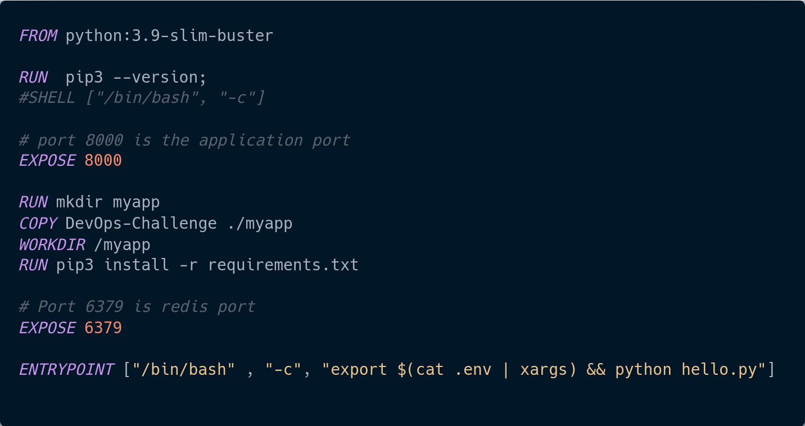
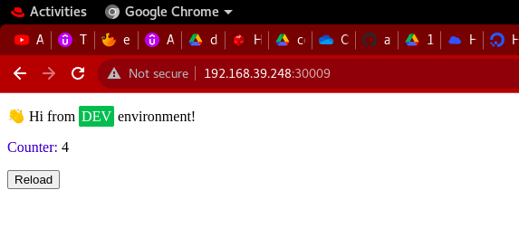

# Using Helm Chart to deploy A Python Application On Kubernetes Cluster

## Project's Description

- Using Helm Chart to deploy A Python Application On Kubernetes Cluster
- A Simple Reload Counter Python Application
- Using Redis As Database

## Requirments

1. Linux os, Windows or Mac os  
2. Docker to be installed 
3. minikube or any cloud kubernetes cluster.
4. helm to be on your machine [ Setup ](https://helm.sh/docs/intro/install/)

## Steps

1. Clonnig the python app code from https://github.com/tradebyte/DevOps-Challenge repo
2. Creating a Dockerfile for the image  

3. Building the image `docker image build -t omarkamal1/my-reload-counter-py-app:v1.0.0 .`
4. Pushed the image to dockerhub `docker push omarkamal1/my-reload-counter-py-app:v1.0.0` [Docker hub](https://hub.docker.com/r/omarkamal1/my-reload-counter-py-app)
5. Creating the chart.yaml 
6. Creating templates directory that contains deployment and service templates
7. Created the helm chart `helm create reload-counter`

## Strating The Project

1. Run `helm install release-name /path/to/project` 
2. To get the ip of the minikube run `kubectl describe no minikube | grep -i InternalIP` in the terminal
3. Then type the returned internalip `InternalIP:30009` in your browser 

## Author

[Omar Kamal ](https://www.linkedin.com/in/omar-soliman-617188208/)